# VK_RAYTRACE
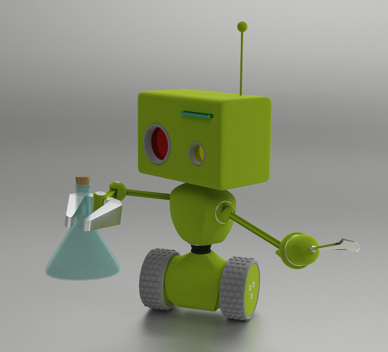

This project is a [glTF 2.0](https://www.khronos.org/gltf/) sample viewer using [Vulkan ray tracing](https://www.khronos.org/blog/vulkan-ray-tracing-final-specification-release). It follows the [ray tracing tutorial](https://github.com/nvpro-samples/vk_raytracing_tutorial_KHR) and combines all chapters into a single example. 

The lighting equation is based on:
* [glTF PBR reference implementation](https://github.com/KhronosGroup/glTF-WebGL-PBR) from Khronos. 
* [Disney PBR](https://blog.selfshadow.com/publications/s2012-shading-course/burley/s2012_pbs_disney_brdf_slides_v2.pdf)

The rendering pipeline can be switched from:
* **Ray Tracing Pipeline**: RayGen, Closest-Hit, Miss, Any-Hit model
* **Ray Query**: Compute shader using Ray Queries

Features
========

- [x] Load glTF 2.0 files ascii and binary using [tiny glTF](https://github.com/syoyo/tinygltf)
- [x] Support for full node hierarchy
- [x] Full implementation of metallic-roughness and specular-glossiness
- [x] IBL lighting using importance light sampling
- [x] Alpha blend and cut-out
- [x] Texture transforms and samplers

### Attributes
  - [x] Normal : create geometric normal when not present
  - [x] Texture coords : only set 0, project cube map when text coords are missing.
  - [x] Tangents : generate tangents and bitangent when missing.
  - [x] Color : default (1,1,1,1)

### Extensions
  - [ ] [KHR_lights_punctual](https://github.com/KhronosGroup/glTF/tree/master/extensions/2.0/Khronos/KHR_lights_punctual) (some support)
  - [x] [KHR_materials_pbrSpecularGlossiness](https://github.com/KhronosGroup/glTF/tree/master/extensions/2.0/Khronos/KHR_materials_pbrSpecularGlossiness)
  - [x] [KHR_materials_clearcoat](https://github.com/KhronosGroup/glTF/tree/master/extensions/2.0/Khronos/KHR_materials_clearcoat)
  - [x] [KHR_materials_unlit](https://github.com/KhronosGroup/glTF/tree/master/extensions/2.0/Khronos/KHR_materials_unlit)
  - [x] [KHR_texture_transform](https://github.com/KhronosGroup/glTF/tree/master/extensions/2.0/Khronos/KHR_texture_transform)
  - [x] KHR_materials_anisotropy
  - [x] [KHR_materials_transmission](https://github.com/KhronosGroup/glTF/tree/master/extensions/2.0/Khronos/KHR_materials_transmission)
  - [ ] [KHR_materials_sheen](https://github.com/KhronosGroup/glTF/tree/master/extensions/2.0/Khronos/KHR_materials_sheen) (some support)

Usage
-----

**Controls**

| Action | Description |
|--------|-------------|
|`LMB`        | Rotate around the target|
|`RMB`        | Dolly in/out|
|`MMB`        | Pan along view plane|
|`LMB + Shift`| Dolly in/out|
|`LMB + Ctrl` | Pan |
|`LMB + Alt`  | Look around |
|`Mouse wheel`| Dolly in/out |
|`Mouse wheel + Shift`| Zoom in/out (FOV)
|`Space`| Set interest point on the surface under the mouse cursor.
|`F10`| Toggle UI pane.

**Change glTF model**

* Drag and drop glTF files (`.gltf` or `.glb`) into viewer

**Change HDR lighting**

* Drag and drop HDR files (`.hdr`) into viewer

Setup
-----

~~~~ 
git clone --recursive --shallow-submodules https://github.com/nvpro-samples/nvpro_core.git
git clone https://github.com/nvpro-samples/vk_raytrace.git
~~~~

Other
-----

Tags: 
- raytracing, GLTF, HDR, tonemapper, picking, BLAS, TLAS, PBR material

Extensions: 
- VK_KHR_RAY_QUERY_EXTENSION_NAME
- VK_KHR_RAY_TRACING_PIPELINE_EXTENSION_NAME
- VK_KHR_ACCELERATION_STRUCTURE_EXTENSION_NAME
- VK_KHR_SHADER_CLOCK_EXTENSION_NAME
- VK_KHR_MAINTENANCE3_EXTENSION_NAME
- VK_KHR_PIPELINE_LIBRARY_EXTENSION_NAME
- VK_KHR_DEFERRED_HOST_OPERATIONS_EXTENSION_NAME
- VK_KHR_BUFFER_DEVICE_ADDRESS_EXTENSION_NAME
- VK_EXT_SCALAR_BLOCK_LAYOUT_EXTENSION_NAME
- VK_EXT_DESCRIPTOR_INDEXING_EXTENSION_NAME
- VK_KHR_GET_MEMORY_REQUIREMENTS_2_EXTENSION_NAME
- VK_KHR_DEDICATED_ALLOCATION_EXTENSION_NAME
- VK_KHR_SWAPCHAIN_EXTENSION_NAME
- VK_KHR_GET_PHYSICAL_DEVICE_PROPERTIES_2_EXTENSION_NAME
- VK_EXT_DEBUG_UTILS_EXTENSION_NAME
- VK_KHR_SURFACE_EXTENSION_NAME

## Links
* [glTF format specification](https://github.com/KhronosGroup/glTF)
* [glTF Sample Models](https://github.com/KhronosGroup/glTF-Sample-Models)
* [tiny glTF library](https://github.com/syoyo/tinygltf)
* [Ray Tracer Tutorial](https://github.com/nvpro-samples/vk_raytracing_tutorial_KHR)

---------------------

Test Scenes
===========

|Model | Link |
|------|------|
|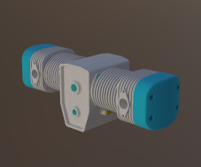  | [2 Cylinder Engine](https://github.com/KhronosGroup/glTF-Sample-Models/tree/master/2.0/2CylinderEngine) |
|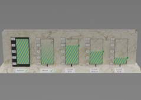 | Alpha Blending |
|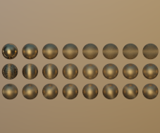  | [Anisotropy](https://github.com/KhronosGroup/glTF-Sample-Models/tree/develop/sample-viewer-enhancements/2.0/AnisotropySpheres/glTF)|
|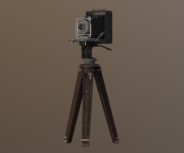  | [Antique Camera](https://github.com/KhronosGroup/glTF-Sample-Models/tree/master/2.0/AntiqueCamera) |
|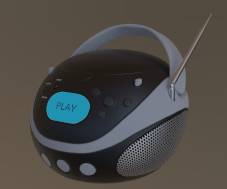  | [Boom Box](https://github.com/KhronosGroup/glTF-Sample-Models/tree/master/2.0/BoomBox) |
|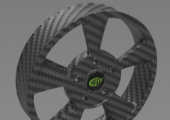 | Carbon Fiber |
| | Clear Coat |
|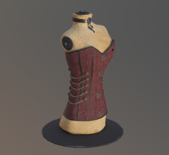  | [Corset](https://github.com/KhronosGroup/glTF-Sample-Models/tree/master/2.0/Corset) |
|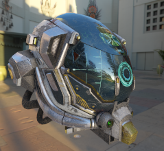  | [Damaged Helmet](https://github.com/KhronosGroup/glTF-Sample-Models/tree/master/2.0/DamagedHelmet)
|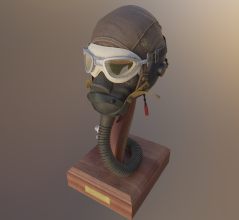  | [Flight Helmet](https://github.com/KhronosGroup/glTF-Sample-Models/tree/master/2.0/FlightHelmet) |
|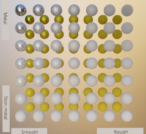 | [Metal Rough Spheres](https://github.com/KhronosGroup/glTF-Sample-Models/tree/master/2.0/MetalRoughSpheres)  |
|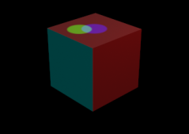 | Punctual Light |
|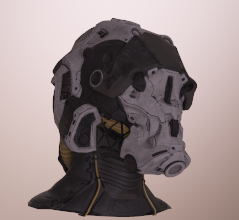  | [SciFi](https://github.com/KhronosGroup/glTF-Sample-Models/tree/master/2.0/SciFiHelmet) |
|  | [SpecGlossVsMetalRough](https://github.com/KhronosGroup/glTF-Sample-Models/tree/develop/sample-viewer-enhancements/2.0/SpecGlossVsMetalRough) |
|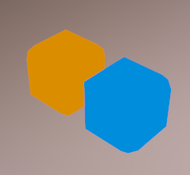  | [Unlit](https://github.com/KhronosGroup/glTF-Sample-Models/tree/master/2.0/UnlitTest) |
|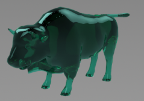 | Transmission |
|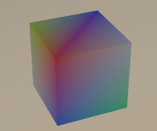  |[Box Vertex Color](https://github.com/KhronosGroup/glTF-Sample-Models/tree/master/2.0/BoxVertexColors) |
